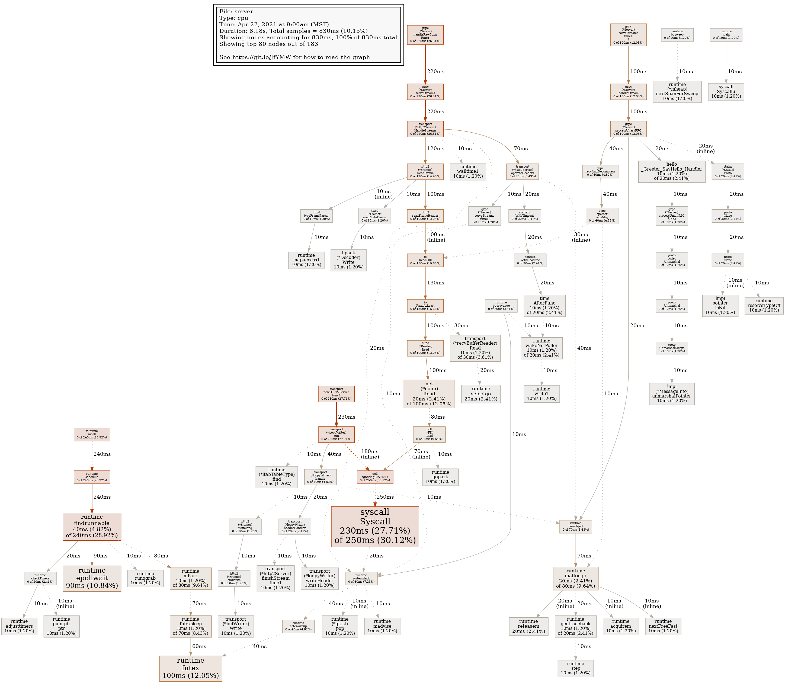

##  proto

```sh
protoc --go_out=. --go_opt=paths=source_relative --go-grpc_out=. --go-grpc_opt=paths=source_relative hello/hello.proto

go mod tidy

go run .

go test -v

go test -bench=. -benchmem -memprofile mem.out -cpuprofile cpu.out -blockprofile block.out -mutexprofile mutex.out

go tool pprof -text -output cpu.txt cpu.out
go tool pprof -png -output cpu.png cpu.out
go tool pprof -png -output mem.png mem.out

go tool pprof -png -output block.png block.out
go tool pprof -png -output mutex.png mutex.out
```
<a href="cpu.txt">cpu.txt</a>


